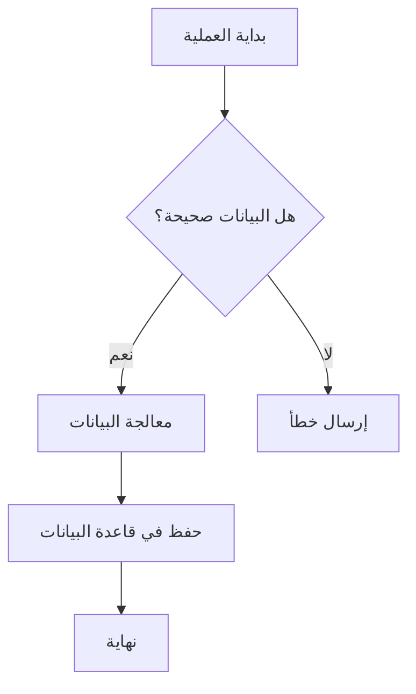
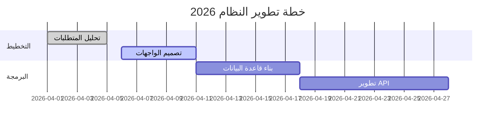

# 🚀 الدليل الشامل والاحترافي للغة Markdown

## 1. التنسيقات المتقدمة والقوائم المتداخلة
في هذا القسم، ندمج بين التنسيقات النصية والقوائم المهام:

* **تنسيقات دقيقة:**
    * نص بأحرف كبيرة وصغيرة: `Code Style`
    * ملاحظة جانبية: ~~نص ملغى~~ و **_نص مائل وعريض في آن واحد_**
    * الاختصارات: استخدم <kbd>Ctrl</kbd> + <kbd>S</kbd> للحفظ.
* **قائمة المهام التقنية (Task List):**
    - [x] إعداد البنية التحتية للمشروع.
    - [s] اختبار التوافقية مع المتصفحات.
    - [ ] إطلاق النسخة التجريبية النهائية.

---

## 2. الجداول البيانية المتقدمة (Tables)
تنسيق الجداول مع محاذاة مختلفة وبيانات متنوعة:

| الميزة التقنية | الحالة | الأولوية | القيمة الرياضية |
| :--- | :---: | :---: | :--- |
| محرك البحث (SEO) | ✅ مدعوم | مرتفعة | $2^n$ |
| سرعة الاستجابة | ⚡ سريع | متوسطة | $\lim_{x \to \infty} \frac{1}{x} = 0$ |
| الأمان الرقمي | 🔒 مشفر | قصوى | $E = mc^2$ |

---

## 3. الرسوم التخطيطية (Mermaid Diagrams)
تسمح لغة Markdown (في المحررات الحديثة) برسم مخططات برمجية مباشرة:

### أ. مخطط التدفق (Flowchart)


### ب. مخطط غانت للمشاريع (Gantt Chart)


---

## 4. التعبيرات الرياضية المعقدة (LaTeX)
لتمثيل المعادلات الفيزيائية والرياضية بدقة عالية:

$$
I = \int_{a}^{b} f(x) dx \quad \Rightarrow \quad \Phi(z) = \frac{1}{\sqrt{2\pi}} e^{-\frac{1}{2}z^2}
$$

وأيضاً المصفوفات:

$$
\begin{pmatrix}
1 & a & a^2 \\
1 & b & b^2 \\
1 & c & c^2
\end{pmatrix}
$$

---

## 5. كتل البرمجة والاقتباسات المتداخلة
> **ملاحظة معمارية:** التصميم الجيد يتطلب تنظيماً دقيقاً للكود.
> > "الكود لا يكذب، لكن التعليقات قد تفعل أحياناً." - *رون جيفريز*

```python
def complex_algorithm(data):
    """
    دالة توضيحية لمعالجة المصفوفات
    """
    result = [x**2 for x in data if x % 2 == 0]
    return f"Processed Result: {result}"

print(complex_algorithm(range(10)))
```

---

## 6. العناصر التفاعلية (HTML Integration)
يمكن دمج عناصر HTML لزيادة التفاعل:

<details>
<summary><b>اضغط هنا لإظهار التفاصيل المخفية 📂</b></summary>

هذا النص يظهر فقط عند النقر على السهم. مفيد جداً للأسئلة الشائعة أو الشروحات الطويلة التي لا تريد إزحام الصفحة بها.
- دعم كامل للروابط الصورية.
- دعم الفيديوهات المضمنة.
</details>

---

## 7. الحواشي السفلية والمراجع (Footnotes)
يمكنك وضع مراجع في نهاية المستند بهذه الطريقة:
هذا المستند تم إنشاؤه باستخدام محرك نصوص متطور[^1].

[^1]: محرك Markdown المخصص للأنظمة المعقدة الإصدار 3.0.

---

### ملخص الأشكال الهندسية (Emoji Art)
| الشكل | الوصف | التمثيل |
| :---: | :--- | :---: |
| 🟦 | مربع أزرق | `:blue_square:` |
| 🔺 | مثلث أحمر | `:red_triangle_up:` |
| 💠 | معين ماسي | `:diamond_shape_with_a_dot_inside:` |